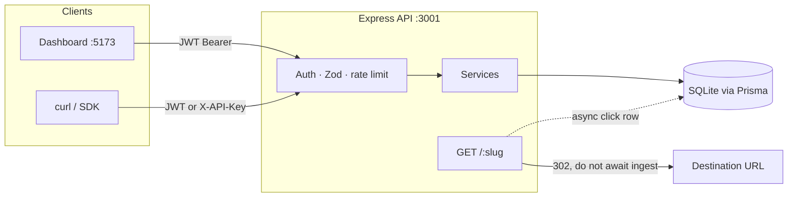
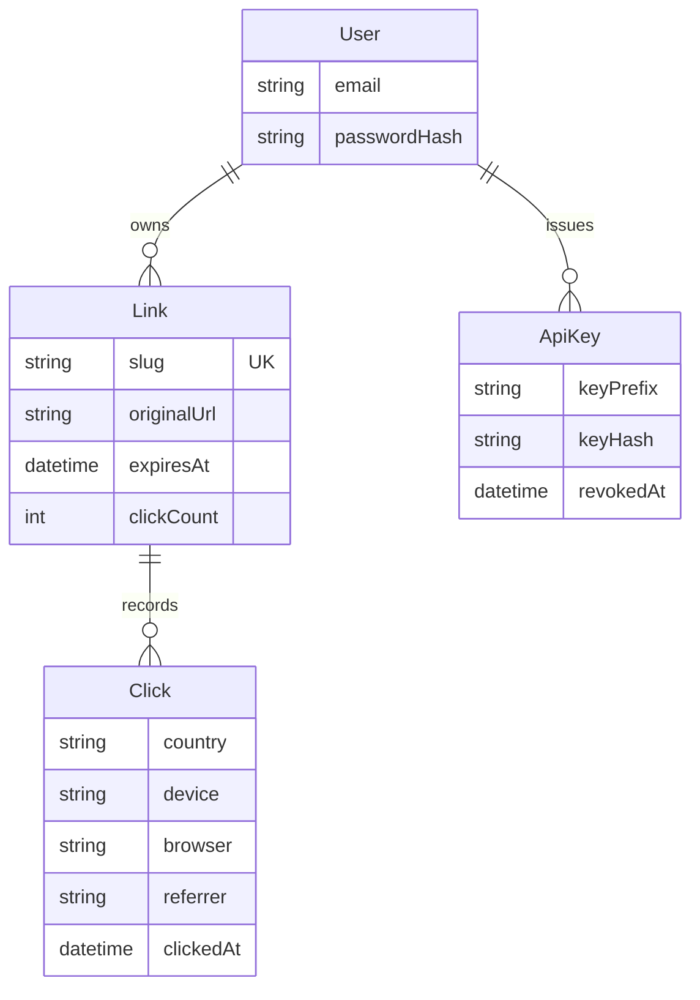

# Relay

**Short links with full telemetry.**

Relay is a URL shortener built like a real backend service — not a `longUrl → slug` script. Every redirect is an ingest event. Every link has an owner, a policy, and an analytics surface.

It is meant to demonstrate backend engineering: authentication, API keys, rate limits, write-path vs read-path, and the rules around a public namespace of short codes.

| Dashboard | API / short links | Health |
| --- | --- | --- |
| [http://localhost:5173](http://localhost:5173) | [http://localhost:3001](http://localhost:3001) | [http://localhost:3001/api/health](http://localhost:3001/api/health) |

```
demo@relay.dev   /   Demo1234!
```

---

## Why this exists

A shortener looks simple until you treat the slug as a **public, contended namespace** and the click as a **write that must not slow the redirect**.

Relay is the system around that problem:

- Who is allowed to create a slug, and how do they authenticate (JWT *or* hashed API key)?
- What happens when two users want `launch`, or someone claims `api`?
- How do you record geo, device, and referrer without adding GeoIP latency to the 302?
- How do you expire, disable, and export a link after the campaign ends?

The dashboard is the read path. The interesting code is the write path.

---

## Features

| | |
| --- | --- |
| **Auth** | Email/password with bcrypt, JWT bearer tokens |
| **API keys** | `sk_live_…` secrets, SHA-256 at rest, shown once, revocable |
| **Custom slugs** | 3–32 chars, reserved-word blocklist, collision check; nanoid if omitted |
| **QR codes** | PNG at `GET /:slug/qr` |
| **Click ingest** | Fire-and-forget on redirect: IP, country, city, device, browser, OS, referrer |
| **Expiration** | Branded `410 Gone` when `expiresAt` has passed |
| **Rate limits** | Sliding window per IP, user, API key, and create-link burst |
| **Dashboard** | Time series, geography, devices, browsers, referrers, top links, CSV export |

---

## Quick start

Requires **Node.js 20+**.

```bash
npm run setup
npm run dev
```

That installs workspaces, generates Prisma Client, creates SQLite, and seeds demo traffic (~7 links, ~1,300 clicks).

Then open [http://localhost:5173](http://localhost:5173) and sign in with the demo account.

| Script | What it does |
| --- | --- |
| `npm run setup` | Install, push schema, seed |
| `npm run dev` | API on `:3001` + dashboard on `:5173` |
| `npm run db:seed` | Re-seed the demo user and traffic |
| `npm run db:setup -w server` | Prisma generate + db push + seed |
| `npx prisma studio` (in `server/`) | Browse the SQLite database |

Copy `server/.env.example` → `server/.env` if you need to change secrets. Defaults work for local demo.

| Variable | Default | Purpose |
| --- | --- | --- |
| `PORT` | `3001` | API listen port |
| `DATABASE_URL` | `file:./dev.db` | SQLite path (relative to `server/prisma/`) |
| `JWT_SECRET` | dev fallback | Sign/verify access tokens |
| `JWT_EXPIRES_IN` | `7d` | Token lifetime |
| `PUBLIC_BASE_URL` | `http://localhost:3001` | Host used in short URLs and QR payloads |
| `BCRYPT_ROUNDS` | `12` | Password hash cost |

---

## Architecture

Two processes, two hostnames — the same split as `app.bitly.com` vs `bit.ly`.



Layers in `server/src`:

| Layer | Role |
| --- | --- |
| `routes/` | HTTP adapters only |
| `services/` | Slug allocation, auth, ingest, aggregations |
| `middleware/` | JWT **or** API key, Zod validation, limiter, errors |
| `lib/` | JWT, bcrypt/SHA-256, GeoIP, UA parser, QR, slug alphabet |

**Redirect path (the hot path):**

1. Look up slug.
2. Reject missing / disabled (`404`) or expired (`410`).
3. Start `recordClick` — GeoIP + UA parse + insert — **without awaiting it**.
4. Return `302` immediately.

Losing a click under crash is better than adding a disk write to the user’s perceived latency.

---

## Data model



Clicks are an **append-only event log**. `Link.clickCount` is a denormalized counter for list views; every breakdown (geo, device, referrer, time series) scans `Click`.

SQLite keeps the demo zero-config. The schema is ordinary relational data — swapping the Prisma datasource to PostgreSQL is the production move. The in-memory limiter is the same idea as Redis `INCR` + TTL, without a second process.

---

## HTTP API

Authenticated routes accept either:

```
Authorization: Bearer <jwt>
X-API-Key: sk_live_…
```

(`Authorization: Bearer sk_live_…` also works.)

Unauthenticated: `POST /api/auth/register`, `POST /api/auth/login`, `GET /api/health`, and the public redirect/QR routes.

### Auth

| Method | Path | Body |
| --- | --- | --- |
| `POST` | `/api/auth/register` | `{ name, email, password }` |
| `POST` | `/api/auth/login` | `{ email, password }` |
| `GET` | `/api/auth/me` | — |

Password rules: ≥ 8 characters, at least one letter and one number.

### Links

| Method | Path | Notes |
| --- | --- | --- |
| `POST` | `/api/links` | Create; `slug` optional |
| `GET` | `/api/links` | `page`, `limit`, `q`, `status=all\|active\|expired\|disabled` |
| `GET` | `/api/links/:id` | |
| `PATCH` | `/api/links/:id` | Destination, slug, title, expiry, `isActive` |
| `DELETE` | `/api/links/:id` | Cascades click history |
| `GET` | `/api/links/:id/analytics` | `range=24h\|7d\|30d\|90d` |
| `GET` | `/api/links/:id/export` | CSV, up to 10k rows |

Create body:

```json
{
  "originalUrl": "https://example.com/very/long/path",
  "slug": "launch-week",
  "title": "Launch",
  "expiresAt": "2026-12-31T23:59:59.000Z"
}
```

### Keys and overview

| Method | Path | Body |
| --- | --- | --- |
| `GET` | `/api/keys` | |
| `POST` | `/api/keys` | `{ name }` — plaintext returned **once** |
| `DELETE` | `/api/keys/:id` | Revoke (soft) |
| `GET` | `/api/analytics/overview` | `range=24h\|7d\|30d\|90d` |

### Public

| Method | Path | Result |
| --- | --- | --- |
| `GET` | `/:slug` | `302`, or branded `404` / `410` |
| `GET` | `/:slug/qr` | `image/png` |

### Example

```bash
# 1. Login
TOKEN=$(curl -s http://localhost:3001/api/auth/login \
  -H "Content-Type: application/json" \
  -d '{"email":"demo@relay.dev","password":"Demo1234!"}' \
  | python -c "import sys,json; print(json.load(sys.stdin)['token'])")

# 2. Create a link
curl -s http://localhost:3001/api/links \
  -H "Authorization: Bearer $TOKEN" \
  -H "Content-Type: application/json" \
  -d '{"originalUrl":"https://example.com","slug":"demo-api"}'

# 3. Hit it
curl -sI http://localhost:3001/demo-api
# Location: https://example.com
```

On Windows PowerShell:

```powershell
$login = Invoke-RestMethod http://localhost:3001/api/auth/login `
  -Method POST -ContentType application/json `
  -Body '{"email":"demo@relay.dev","password":"Demo1234!"}'

Invoke-RestMethod http://localhost:3001/api/links `
  -Headers @{ Authorization = "Bearer $($login.token)" } `
  -Method POST -ContentType application/json `
  -Body '{"originalUrl":"https://example.com","slug":"demo-api"}'
```

---

## Rate limits

| Surface | Window |
| --- | --- |
| Register | 8 / 15 min / IP |
| Login | 12 / 15 min / IP |
| JWT session | 90 / min / user+IP |
| API key | 120 / min / key |
| Create link | 60 / hour / user |
| Redirect | 300 / min / IP |

Every limited response includes `X-RateLimit-Limit`, `X-RateLimit-Remaining`, `X-RateLimit-Reset`. A `429` also sets `Retry-After`.

---

## Errors

```json
{
  "error": {
    "code": "SLUG_TAKEN",
    "message": "That custom slug is already in use"
  }
}
```

| Code | Status | When |
| --- | --- | --- |
| `UNAUTHORIZED` | 401 | Missing/invalid JWT or API key |
| `INVALID_CREDENTIALS` | 401 | Bad email/password |
| `VALIDATION_ERROR` | 400 | Zod failed (body/query) |
| `SLUG_TAKEN` | 409 | Custom slug already exists |
| `SLUG_RESERVED` | 409 | Slug is a reserved route (`api`, `health`, …) |
| `EMAIL_TAKEN` | 409 | Register with an existing email |
| `NOT_FOUND` | 404 | Unknown link, key, or route |
| `EXPIRED` | 410 | Public hit on a past `expiresAt` |
| `RATE_LIMITED` | 429 | Window exceeded |
| `FORBIDDEN` | 403 | Authenticated but not the owner |

---

## Design notes

These are the decisions worth reading in the code.

1. **Redirects do not wait on analytics.** `recordClick` is not `await`ed. See `server/src/routes/redirect.ts`.
2. **API keys are never stored in plaintext.** Only a prefix is kept for the UI; verification is a SHA-256 lookup. The full key is returned on create, once.
3. **Self-shortening is rejected.** A Relay URL cannot redirect to another Relay URL on the same host (loop prevention).
4. **Slugs are a namespace.** Reserved routes cannot be claimed as custom codes. The generator uses a 32-char alphabet with ambiguous glyphs (`0/O`, `1/l`) removed.
5. **Identity is dual-mode.** The same handlers accept a user JWT or a hashed key. Keys get a higher rate limit (120 vs 90) because they are meant for automation.
6. **Private IPs are labeled `Local`.** GeoLite has nothing useful for `127.0.0.1`; the dashboard still has a bucket instead of a hole.

---

## Project layout

```
.
├── client/                     React dashboard (Vite + Tailwind + Recharts)
│   └── src/
│       ├── pages/              Overview, links, link detail, API keys
│       ├── components/         Charts, layout, shared UI
│       └── api.ts              Typed fetch client
└── server/
    ├── prisma/
    │   ├── schema.prisma       User, ApiKey, Link, Click
    │   └── seed.ts             demo@relay.dev + synthetic traffic
    └── src/
        ├── routes/             HTTP adapters
        ├── services/           Domain logic
        ├── middleware/         Auth, validation, limiter
        └── lib/                JWT, geo, UA, QR, slug, hash
```

**Stack:** TypeScript, Express, Prisma, SQLite, Zod, React, Vite, Tailwind, Recharts, geoip-lite, ua-parser-js.

---

## Production follow-ups

Not missing demo features — the next engineering steps if this left localhost:

- PostgreSQL + Redis (rate limits, hot slug cache)
- A queue (BullMQ) for click ingest under burst traffic
- MaxMind GeoLite2-City instead of the offline `geoip-lite` snapshot
- HttpOnly cookies for the dashboard session
- Bot filtering and unique-visitor cookies
- Daily rollup tables so analytics does not scan the raw event log forever
